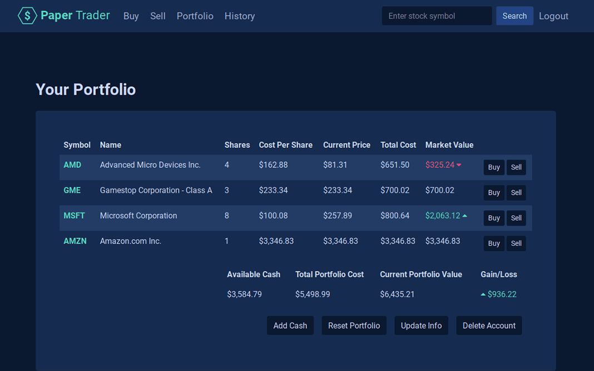

# Paper Trader
A paper trading web application to practice trading stocks, built with [Flask](https://flask.palletsprojects.com/en/2.0.x/).



## Demo App
You can see a demo version of the application deployed to Heroku here: https://flask-paper-trader.herokuapp.com/

## Functionality
Users can create an account and search for stock quotes for companies as well as get recent news articles regarding the stock. Users can practice buying and selling stocks based on a set amount of money they define at account creation and track their hypothetical gains and losses.

Users can see their holdings on a stock's quote page if they own shares in it. There is a portfolio page where users can see their collection of holdings and compare their average stock purchase prices with current stock values as well as easily buy and sell them. Users can add (pretend) money to their account or reset their account to a blank state. There is also a history page where users can see all their past transactions.

## Install Instructions
The application depends on Python, which can be installed and managed a variety of ways. For this project, I used [pyenv](https://github.com/pyenv/pyenv) and [pyenv-virtualenv](https://github.com/pyenv/pyenv-virtualenv), following [this guide](https://realpython.com/intro-to-pyenv/).

Once Python is installed, install [Flask](https://flask.palletsprojects.com/en/2.0.x/installation/) and dependencies using the command: `pip install -r requirement.txt` or `python -m pip install -r requirement.txt`.

API keys for [IEX](https://iexcloud.io/) and [News API](https://newsapi.org/) are required to run the application. They can be acquired from the previous links. You also need to set up a [PostgreSQL database](https://www.postgresql.org/docs/12/tutorial-createdb.html).

To run the application in development mode, configure Flask by entering the following commands in the application directory:

```
export FLASK_APP=app.py
export FLASK_ENV=development
export DATABASE_URL=""
export IEX_API_KEY=""
export NEWS_API_KEY=""
```
Insert the url for the Postgresql database in the quotes after DATABASE_URL. Insert the News API and IEX API keys in their respective spots as well (after registering for accounts).

Run migrations with the command `flask db upgrade` or `python -m flask db upgrade`. Then run either `flask run` or `python -m flask run` to start the development server.

For production, the application uses [Gunicorn](https://gunicorn.org/) for the server as defined in the [Procfile](/Procfile) (for [Heroku](https://www.heroku.com/) deployment).

## Project Structure
[`app.py`](/app.py) - Application (controller) logic is defined here. All routes are processed and requests are responded to.

[`config.py`](/conifg.py) - Configuration settings for different environments are stored here (development, production, etc.).

[`models.py`](/models.py) - Models are defined here using [SQLAlchemy](https://flask-sqlalchemy.palletsprojects.com/en/2.x/) as the ORM. This forms the basis for the database [migrations](/migrations).

[`helpers.py`](/helpers.py) - Helper functions (like implementation of API calls) are defined here. These functions are called in [app.py](/app.py) or in [templates](/templates).

[`/templates`](/templates) - This directory contains all the templates (views) used by [app.py](/app.py) to produce HTML responses to requests (with the help of [Jinja](https://jinja.palletsprojects.com/en/3.0.x/) templating).

[`/migrations`](/migrations) - This directory contains the necessary files to migrate schema from the [models](/models.py) file to the [PostgreSQL](https://www.postgresql.org/) database using [Flask-Migrate](https://flask-migrate.readthedocs.io/en/latest/) (which in turn uses [Alembic](https://alembic.sqlalchemy.org/en/latest/)).

[`requirements.txt`](/requirements.txt) - This file is used by Python to keep track of the application's dependencies.

[`Procfile`](/Procfile) - Configuration for Heroku production deployment is stored here (which is set up to use [Gunicorn](https://gunicorn.org/)).

`.env` - You can store environment variables like FLASK_APP, FLASK_ENV, DATABASE_URL, IEX_KEY, GOOGLE_NEWS_KEY here (not commited to Git). If doing so, it needs to be configured using [Python-dotenv](https://github.com/theskumar/python-dotenv) or [direnv](https://github.com/direnv/direnv).

## More Info
This application began as the final project for Harvard's CS50x Computer Science course:
https://cs50.harvard.edu/x/2021/project/, inspired by [CS50 Finance](https://cs50.harvard.edu/x/2021/psets/9/finance/).

## License
This project is open source under the terms of the [MIT License](http://opensource.org/licenses/MIT).